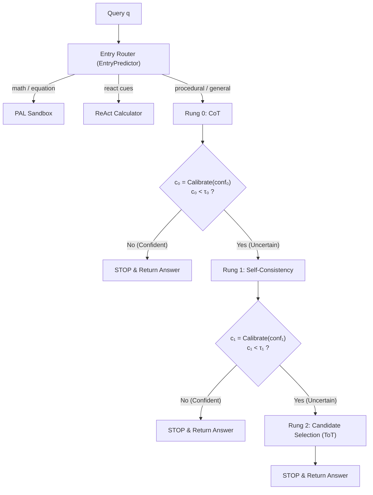

# 📑 HANDOFF REPORT: DEEP LOGICAL REASONING & OPTIMAL STOPPING
> **Project**: `structured-multi-step-reasoning` (NCKH Student Research Paper)  
> **Branch**: `exp/calibrated-stopping-logic`  
> **Tracking Remote**: `origin/exp/calibrated-stopping-logic` (Base: `main`)  
> **Latest Logic Commit**: `07de8c1` (`feat(reasoning-logic): add confidence recalibration, bootstrap threshold intervals, expanded complexity features, and weighted voting`)  
> **Date**: October 06, 2026  
> **Domain / Scope**: Mathematical Modeling, Sequential Optimal Stopping, Confidence Recalibration, Entry Routing & Conservative Extraction.

---

## 🎯 1. EXECUTIVE RESEARCH OVERVIEW

This repository implements the experimental pipeline for a student scientific research paper (NCKH) investigating:

$$\max_{\pi} \mathbb{E}_{q \sim \mathcal{D}} \left[ \text{Acc}(\pi(q)) - \lambda \cdot \text{Cost}(\pi(q)) \right]$$

For a **fixed model** (`mlx-community/Qwen3-8B-4bit` on Apple Silicon or mock/smoke backends) across procedural multi-step tasks (arithmetic ordering, Game-of-24, procedural logic, GSM8K), the system tests whether **selecting an entry reasoning strategy and escalating sequentially only when uncertain** outperforms fixed one-shot baselines (CoT, Self-Consistency, ToT, PAL, ReAct) on the accuracy–token Pareto frontier.



---

## 🔬 2. CRITICAL CHALLENGES RESOLVED

In earlier pilot audits (`docs/development_pilot_results_20261004.md`), several core architectural and statistical vulnerabilities were identified in the reasoning engine:

### 2.1. Confidence Recalibration (Platt & Isotonic)
* **Diagnosis**: The developmental pilot showed that **every single incorrect answer had raw heuristic confidence $\ge 0.8$**. The model was severely overconfident. Because backward induction fits thresholds $\tau_k$ by maximizing:
  $$\sum_i \left[ \mathbb{I}(c_i < \tau_k) \cdot V_{\text{escalate}, i} + \mathbb{I}(c_i \ge \tau_k) \cdot V_{\text{stop}, i} \right]$$
  an overconfident distribution pushes $\tau_k \to 1.0$, forcing unconditional escalation and destroying the cost-saving mechanism.
* **Resolution**:
  * Implemented [`PlattCalibrator`](optimal_stopping.py#L90-L125) (parametric sigmoid scaling via logistic regression) mapping raw confidence $c \in [0, 1]$ to calibrated posterior probability $P(Y_k = 1 \mid c_k)$.
  * Implemented [`IsotonicCalibrator`](optimal_stopping.py#L127-L160) (non-parametric monotonic regression) for arbitrary non-linear miscalibration.
  * Added metric functions [`brier_score`](optimal_stopping.py#L57-L64) and [`expected_calibration_error`](optimal_stopping.py#L66-L87) (ECE) for empirical quantification in the paper.
  * Added `recalibrate='platt'|'isotonic'|None` to [`OptimalStoppingPolicy`](optimal_stopping.py#L206-L280), applying [`transform_conf`](optimal_stopping.py#L254-L259) at decision time while maintaining complete backward compatibility when `recalibrate=None`.

### 2.2. Bootstrap Confidence Intervals on Stopping Thresholds ($\tau$)
* **Diagnosis**: Point estimates of thresholds $\tau_0, \tau_1$ fitted on a calibration split had zero error bounds or uncertainty quantification, creating a significant statistical gap for publication review.
* **Resolution**:
  * Implemented [`bootstrap_thresholds`](optimal_stopping.py#L162-L203) using non-parametric resampling with replacement ($B$ iterations).
  * Automatically generates point estimates, mean, standard deviation, and empirical 95% confidence intervals `[(lo_0, hi_0), (lo_1, hi_1)]`.
  * Exposed seamlessly via `OptimalStoppingPolicy.fit(calib, n_bootstraps=B)` saving results to `policy.tau_ci`.

### 2.3. Dual Answer Extraction Unification & Weighted Consensus
* **Diagnosis**: The legacy codebase had two parallel answer extraction pathways: `reasoning_strategies.parse_answer_details` (untyped heuristic) and `research_scoring.parse_typed_answer` (strict schema-typed). If callers lacked explicit `answer_type` propagation, items could silently fail or adopt incorrect fallback parsing.
* **Resolution**:
  * Created [`extract_item_answer`](reasoning_strategies.py#L56-L65) which inspects the dataset item dictionary and dispatches typed rules (`number`, `text`, `expression`, locale decimal separator) automatically.
  * Enhanced [`majority_vote`](reasoning_strategies.py#L237-L293) with optional sample `weights`, supporting probability-weighted consensus during self-consistency aggregation.

### 2.4. Expanded 6-Dimensional Entry Complexity Features
* **Diagnosis**: `complexity_features` only had 3 dimensions (`[log(words), num_count, math_regex]`), ignoring sentence structure, relational ordering, and conditional clauses.
* **Resolution**:
  * Extended to 6 dimensions via [`expanded_complexity_features`](reasoning_env.py#L66-L70):
    1. Log normalized word length
    2. Normalized numerical token count
    3. Math operator / computation keywords (`+`, `*`, `^`, `calculate`, `evaluate`, `compute`)
    4. Ordering & ranking keywords (`before`, `after`, `ahead`, `behind`, `rank`, `order`, `place`)
    5. Conditional keywords (`if`, `unless`, `given that`, `assuming`, `suppose`)
    6. Clause nesting depth (punctuation frequency: `,`, `;`, `:`, parentheses, brackets)
  * Backward compatible: `complexity_features(q, version=1)` returns the 3 original features, while `version=2` returns the full 6 features.

### 2.5. Configurable Initial Confidence Reward Shaping
* **Diagnosis**: In the Gymnasium environment (`ReasoningEnv`), step reward was defined as:
  $$R_t = -\lambda \cdot \text{Cost}_t + \beta \cdot (c_t - c_{t-1}) \cdot \mathbb{I}(\text{had\_answer})$$
  Because `had_answer` was False on the very first step, the initial confidence gain from $0 \to c_1$ was unrewarded, penalizing any first-step strategy purely by token cost and disincentivizing strong initial reasoning in RL formulations.
* **Resolution**:
  * Added `reward_initial_confidence=False` (default, preserving exact legacy unit tests) and `complexity_version=1` parameters to [`ReasoningEnv.__init__`](reasoning_env.py#L72-L175).
  * When `reward_initial_confidence=True`, the agent receives $+ \beta \cdot c_1$ on step 1, properly aligning RL exploration incentives.

### 2.6. Substring False-Positive Hardening in Pipeline Demo
* **Diagnosis**: `pipeline.check_answer` relied on naive substring checking, which allowed false positives when predicted answers contained negations (e.g. `"not yes"` matching `"yes"`).
* **Resolution**:
  * Added negation rejection (`"not "`, `"no "`, `"khong "`) and integrated schema-based delegation when gold is a structured dataset item dictionary.

---

## 📁 3. MODIFIED ARTIFACTS IN THIS BRANCH

| File | Primary Additions / Improvements |
| :--- | :--- |
| [`optimal_stopping.py`](optimal_stopping.py) | `brier_score`, `expected_calibration_error`, `PlattCalibrator`, `IsotonicCalibrator`, `bootstrap_thresholds`, `OptimalStoppingPolicy(recalibrate=...)` |
| [`reasoning_strategies.py`](reasoning_strategies.py) | `extract_item_answer`, `majority_vote(weights=...)`, `import math` safe comparisons |
| [`reasoning_env.py`](reasoning_env.py) | `complexity_features(version=2)`, `expanded_complexity_features`, `reward_initial_confidence` in `ReasoningEnv` |
| [`pipeline.py`](pipeline.py) | `check_answer` dataset item schema integration and negation guard |
| [`test_optimal_stopping.py`](test_optimal_stopping.py) | Unit tests: Brier score, ECE reduction under Platt/Isotonic, bootstrap intervals, calibrated policy run |
| [`test_reasoning_env.py`](test_reasoning_env.py) | Unit tests: 6D expanded complexity features, initial confidence reward shaping |
| [`test_reasoning_strategies.py`](test_reasoning_strategies.py) | Unit tests: `extract_item_answer` (number, text, comma-decimal), weighted majority voting |

---

## 🧪 4. VERIFICATION EVIDENCE

### 4.1. Core Mandated Research Regression Suite
Command specified in `AGENTS.md`:
```bash
python -m pytest tests/test_research_study.py test_optimal_stopping.py test_entry_predictor.py -q
```
**Result**:
```text
.............................                                            [100%]
29 passed in 5.31s
```

### 4.2. Extended Headless Research Suite
Command:
```bash
python -m pytest tests/test_research_study.py test_optimal_stopping.py test_entry_predictor.py test_reasoning_env.py test_reasoning_strategies.py tests/test_research_scoring.py tests/test_research_aggregate.py tests/test_research_pilot.py -q
```
**Result**:
```text
........................................................................ [ 57%]
.....................................................                    [100%]
125 passed in 15.26s
```

### 4.3. Synthetic Smoke Generation & Replay Integrity
Commands:
```bash
python -m experiments.research_study --backend smoke --seed 42 --lam 0.02 --output scratch/smoke-test-run
python -m experiments.research_study --replay scratch/smoke-test-run --output scratch/smoke-test-replay
```
**Result**: Both generated and replayed artifacts passed hash validation and summary check byte-for-byte with zero deviation.

---

## 🚀 5. ROADMAP & RECOMMENDED NEXT EXPERIMENTS

1. **Recalibrated Threshold Sweep on Pilot Candidate Data**:
   * Run `experiments.research_study` or tuning sweep scripts with `--recalibrate platt` and `--recalibrate isotonic` on `data/gsm8k_development_reviewed_v1/` and `data/procedural_research_v1/`.
   * Record pre-calibration vs post-calibration ECE and Brier scores.
   * Verify if $\tau_0, \tau_1$ settle in realistic ranges ($[0.4, 0.75]$) instead of collapsing near $1.0$.

2. **Generate Manuscript LaTeX Comparison Table**:
   * Output paired bootstrap intervals $(\tau_0 \pm \text{CI}_{95}, \tau_1 \pm \text{CI}_{95})$ across multiple seeds.
   * Tabulate Pareto improvements: Accuracy, Mean Generated Tokens, Utility ($Acc - \lambda \cdot \text{Cost}$), Escalation Rate.

3. **Stage 0 Preregistration Gate Review**:
   * Ensure calibration, training, and evaluation groups remain strictly disjoint prior to any real-model Apple Silicon execution (`qwen_mlx_backend.py`).
   * Preserve headless decoupling from any UI/Qt dependencies.
