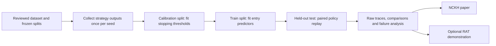

# Structured Multi-Step Reasoning

Research prototype for **budget-aware strategy selection and stopping with a fixed language model**.

The primary deliverables are a student research paper (NCKH) and a reproducible
experiment pipeline. The RAT desktop app is a secondary demonstration for a
nontechnical user. See the [research plan](docs/research_plan.md) for priorities,
milestones and the manuscript outline.

**Status:** the controller, model adapters and experiment harness exist.
The checked-in legacy reasoning results are simulated. They do not establish
accuracy improvements, token savings or hardware performance on a real model.
There is no validated paper result yet.

## Research question

For a fixed model and task distribution, does selecting a reasoning strategy
and escalating only when needed improve the accuracy–token trade-off compared
with fixed strategies and a separately trained one-shot router?

The candidate contribution is the evaluated combination of entry routing and
sequential stopping, including where it fails. Novelty and effectiveness remain
to be established against prior work. The implementation reuses known
strategies; it does not train a new foundation model.



## Quickstart

The research entry point is `experiments.research_study`. It requires no Qt
windows, file indexing, personal documents or app services.

```bash
python3 -m venv .venv
source .venv/bin/activate
python -m pip install -r requirements-research.txt
python -m experiments.research_study --backend smoke --seed 42 --lam 0.02 --output runs/smoke-42
```

This runs **synthetic smoke validation only**, without downloading model weights.
Accuracy and token numbers are artificial. Existing run directories are never
overwritten. Recompute the same decisions and statistics without model calls:

```bash
python -m experiments.research_study --replay runs/smoke-42 --output runs/smoke-42-replay
```

Replay checks implementation and input artifact hashes and retains the original
seed and cost penalty. It does not accept new experimental settings.

Aggregate repeated generations on the same frozen questions through the same
entry point. For example, these seeds exercise the software with synthetic data:

```bash
python -m experiments.research_study --backend smoke --seed 11 --output runs/smoke-11
python -m experiments.research_study --backend smoke --seed 22 --output runs/smoke-22
python -m experiments.research_study --backend smoke --seed 33 --output runs/smoke-33
python -m experiments.research_study --aggregate runs/smoke-11 runs/smoke-22 runs/smoke-33 --output runs/smoke-aggregate
```

Aggregation checks artifact hashes, test pairing, and recorded path costs. It
requires distinct seeds and matching dataset, lambda, model metadata, source
hashes and runtime. It reports per-seed outcomes, variability and paired group
intervals after averaging seeds per question. Repeated seeds do not increase
the number of independent questions. Real experiments require seeds frozen
before test inspection; these example seeds are not a preregistration.

After completing data/model review and the applicable Stage 0 gate, measured
collection is available on Apple Silicon with `mlx-lm` installed:

```bash
python -m experiments.research_study --backend mlx --dataset data/procedural_research_v1/main.json --model /path/to/pinned-mlx-model --seed 42 --lam 0.02 --output runs/measured-42
```

The bundled dataset is a preparation candidate; human/source and held-out
review remain pending. The pinned model path is an input to prepare. See the
[dataset contract and measurement protocol](docs/research_protocol.md).
Model failures do not fall back to synthetic generation. The MLX adapter counts
**generated tokens**, not prompt tokens. Collected results are **paired replay
estimates**, not measured online policy latency.

Each run saves its manifest, exact dataset, raw attempts, records for replay,
fitted thresholds, per-query decisions, metrics and a report. Failed runs retain
a failed manifest and completed attempts.

Regenerate the procedural candidate without model calls or changing legacy
inputs:

```bash
python -m scripts.build_procedural_research_data --split-seed 42 --output data/NEW_RELEASE_DIRECTORY
```

The [release report](data/procedural_research_v1/report.md) records 179 main-study
items in 177 canonical groups and a separate 94-item exposed tuning pool.
Canonical identities keep renamed ordering puzzles in one group, all groups
stay within one split, and tuning/main identities are disjoint. Eligible
original test items retain test status; reviewed development content is never
promoted into test. The study runner rejects the development-only tuning file.

The [completed Qwen3-8B tuning review](audit/qwen3-8b-tuning-review-20261003/report.md)
reproduces the 188 historical parser/scorer outcomes and records retrospective
typed scores separately. Unequal DIRECT/CoT token limits and floor/ceiling
effects prevent freezing difficulty or strategy claims from this run alone.
The presentation parser now accepts whole-answer bold and repeated Answer:
labels while retaining the full candidate for strict scoring. Raw artifacts
remain unchanged; the review makes no model calls and does not change Stage 0.

## Implemented comparisons

| Method | Purpose |
| --- | --- |
| Fixed CoT, self-consistency, candidate selection, ReAct calculator, PAL | Measure component strategies independently |
| One-shot router | Independently fit routing to fixed CoT/ReAct/PAL outcomes |
| Ladder only | Measure stopping without entry routing |
| Entry without escalation | Remove escalation while retaining the full policy's entry choices |
| Full policy | Combine routing with calibrated ladder stopping |

Every method uses the same recorded outputs for a query, strategy and seed.
Escalation pays for every executed strategy. Thresholds use `calibration`;
routing predictors use `train`; reported comparisons use only `test`.

The legacy action named `TOT` in the MLX adapter generates candidates and selects
one; it is **not a full Tree-of-Thoughts search**. ReAct currently exposes a
calculator, not document search. Confidence is a heuristic signal, not a verified
probability of correctness. The one-shot baseline is not an official
reproduction of Route-to-Reason.

## Evidence and project layout

- [Research plan](docs/research_plan.md): hypotheses, priorities, milestones and paper outline.
- [Related papers](docs/related_work.md) and [BibTeX](docs/references.bib): primary-source reading list, including Declarative Attention.
- [Research protocol](docs/research_protocol.md): split, scoring, cost accounting and artifacts.
- [Stage 0 retrieval protocol](docs/stage0_protocol.md): separate retrieval baseline and feedback work.
- [Legacy simulation report](docs/reasoning_benchmark_results.md): archived numbers excluded from model-performance claims.
- `structured_reasoning.ipynb` and `pipeline.py`: exploratory implementations, not the publication entry point.

The earlier README's headline accuracy, speedup, crash-free and globally optimal
policy claims have been withdrawn from the overview because the current
artifacts do not establish them. Passing software tests does not establish
reasoning quality.

```text
experiments/research_study.py   Headless collection, paired replay and reporting
experiments/research_aggregate.py  Verified multi-seed analysis and group intervals
entry_predictor.py             Per-candidate correctness and cost predictors
optimal_stopping.py            Backward threshold fitting over the reasoning ladder
reasoning_env.py               Shared action definitions and experimental environment
reasoning_strategies.py        Answer extraction and tool helpers
qwen_mlx_backend.py            Apple Silicon generation adapter
requirements-research.txt      Research dependencies without the desktop UI
docs/research_plan.md          NCKH scope and manuscript outline
docs/research_protocol.md      Reproduction and evidence contract
rat/                          Secondary desktop demonstration
tests/test_research_study.py   Research integrity regression tests
```

Contributors should prepare reviewed data and frozen experiment inputs before
adding app styling or UI features. Exchange the same commit, dataset version
and model snapshot when reproducing results. Desktop dependencies remain in
`requirements.txt`; app usability is evaluated separately.

The [development data/scoring audit](audit/development-data-20261003-final/report.md)
verifies 222 development items and records agent review provenance. It repairs
scoring and wording issues while preserving all held-out rows. The existing
procedural releases contain renamed ordering problems across splits and need
new groups/splits before the main study; human/source review is still pending.
Reproduce the read-only audit with:

```bash
python -m scripts.audit_development_data --output audit/development-audit-new
```

Research checks:

```bash
python -m pytest tests/test_research_study.py test_optimal_stopping.py test_entry_predictor.py -q
python -m pytest tests/test_research_aggregate.py -q
python -m pytest tests/test_research_scoring.py tests/test_development_data_audit.py tests/test_gen_tasks.py test_reasoning_strategies.py test_qwen_mlx_backend_mocked.py -q
```

Collaboration hub:
[Thundercok/structured-multi-step-reasoning](https://github.com/Thundercok/structured-multi-step-reasoning).
