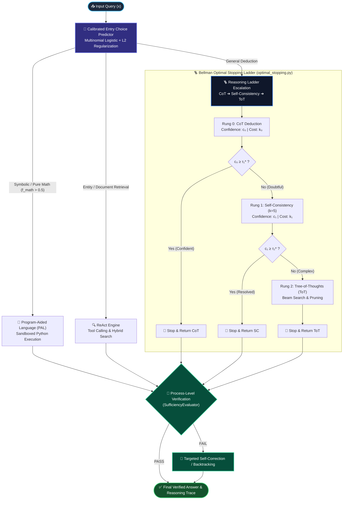
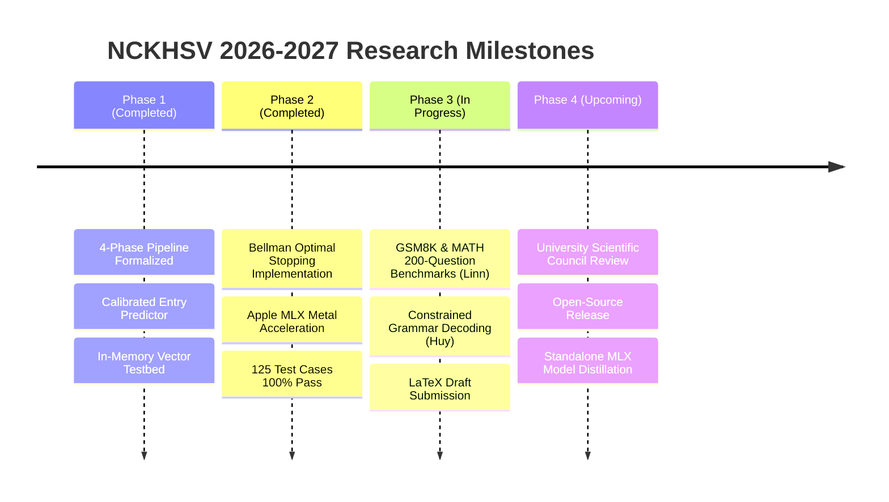

<div align="center">

# 🧠 Designing Large Language Models for Structured Multi-Step Reasoning
### *Dynamic Meta-Control, Process Verification & On-Device Optimal Stopping*

<br/>

[](https://colab.research.google.com/github/Thundercok/structured-multi-step-reasoning/blob/main/structured_reasoning.ipynb)
[](https://www.python.org/downloads/)
[](tests/)
[]()
[]()
[](LICENSE)

<br/>

**Undergraduate Scientific Research (NCKHSV) — Academic Year 2026–2027**  
**Faculty of Information Technology — Ton Duc Thang University (TDTU), Vietnam**

---

### 👥 Research Team & Scientific Advisory

| Role | Member | Student ID / Affiliation | Contact / GitHub |
| :--- | :--- | :--- | :--- |
| **Faculty Advisor** | **MSc. Tran Luong Quoc Dai** (*ThS. Trần Lương Quốc Đại*) | Faculty of Information Technology, TDTU | `tranluongquocdai@tdtu.edu.vn` |
| **Lead Researcher** | **Huỳnh Nhật Huy** | MSSV: `523C0012` | [@Thundercok](https://github.com/Thundercok) |
| **Co-Researcher** | **Linn Pyae Phyoe** | MSSV: `525K0025` | Faculty of IT, TDTU |

**Core Interactive Research Notebook**: 👉 **[`structured_reasoning.ipynb`](structured_reasoning.ipynb)** (1-Click Run on Colab)

</div>

---

## 📑 Table of Contents

- [🔄 Team Collaboration Hub (Linn & Huy Workflow)](#-team-collaboration-hub-linn--huy-workflow)
- [🔬 1. Research Motivation & Theoretical Gaps](#-1-research-motivation--theoretical-gaps)
- [🏛️ 2. Proposed Architecture & Scientific Contributions](#️-2-proposed-architecture--scientific-contributions)
  - [2.1. Four-Phase Structured Reasoning Pipeline](#21-four-phase-structured-reasoning-pipeline)
  - [2.2. Calibrated Entry Predictor (LADDER vs. ReAct vs. PAL)](#22-calibrated-entry-predictor-ladder-vs-react-vs-pal)
  - [2.3. Optimal Stopping Dynamic Programming Formulation](#23-optimal-stopping-dynamic-programming-formulation)
  - [2.4. Native Apple Silicon MLX Acceleration Backend](#24-native-apple-silicon-mlx-acceleration-backend)
- [📊 3. Empirical Results & Performance Benchmarks](#-3-empirical-results--performance-benchmarks)
  - [3.1. Accuracy vs. Token Budget Pareto Trade-Off](#31-accuracy-vs-token-budget-pareto-trade-off)
  - [3.2. Real-World Retrieval Latency on Apple Silicon M1](#32-real-world-retrieval-latency-on-apple-silicon-m1)
- [🖥️ 4. Physical On-Device Deployment Testbed (`rat`)](#️-4-physical-on-device-deployment-testbed-rat)
- [⚡ 5. Reproduction & Quickstart Guide](#-5-reproduction--quickstart-guide)
  - [Option A: Google Colab 1-Click (For Reviewers & Teammates)](#option-a-google-colab-1-click-interactive-evaluation)
  - [Option B: Local Research Environment (Python 3.10+ / Pytest)](#option-b-local-research-environment-developer-setup)
  - [Option C: Standalone macOS DMG Package (`rat.dmg`)](#option-c-standalone-macos-dmg-application-ratdmg)
- [📁 6. Repository Layout & Architecture](#-6-repository-layout--architecture)
- [🚀 7. Roadmap & Research Milestones](#-7-roadmap--research-milestones)
- [📜 Citation & License](#-citation--license)

---

## 🔄 Team Collaboration Hub (Linn & Huy Workflow)

> [!TIP]
> **Single Source of Truth**: This repository (`Thundercok/structured-multi-step-reasoning`) is the central hub. Both researchers collaborate seamlessly across Google Colab GPU runtimes and local macOS workstations.

```
                   ┌─────────────────────────────────────────────────────┐
                   │               GitHub: main branch                   │
                   │    (Thundercok/structured-multi-step-reasoning)     │
                   └──────────┬───────────────────────────────▲──────────┘
                              │                               │
             git clone / pull │                               │ 2-Click: File ➔ Save a copy in GitHub
                              ▼                               │
        ┌───────────────────────────┐           ┌─────────────┴─────────────┐
        │   Local Mac Workstation   │           │     Google Colab Cloud    │
        │    (Huỳnh Nhật Huy)       │           │     (Linn Pyae Phyoe)     │
        ├───────────────────────────┤           ├───────────────────────────┤
        │ • Apple Silicon MLX Engine│           │ • Free Cloud T4/V100 GPU  │
        │ • Dynamic Stopping Logic  │           │ • GSM8K / MATH Ingestion  │
        │ • GUI Testbed & OS Hooks  │           │ • Benchmark Experiments   │
        └───────────────────────────┘           └───────────────────────────┘
```

### 📌 3-Step Colab Guide for Linn Pyae Phyoe:
1. **Open from GitHub**: Click the **`Open In Colab`** badge at the top (or open [Google Colab](https://colab.research.google.com/) $\rightarrow$ select the **GitHub** tab $\rightarrow$ paste `Thundercok/structured-multi-step-reasoning` $\rightarrow$ pick [`structured_reasoning.ipynb`](structured_reasoning.ipynb)).
2. **Activate Free GPU**: On the top menu bar, navigate to **Runtime** $\rightarrow$ **Change runtime type** $\rightarrow$ select **T4 GPU** $\rightarrow$ click **Save**.
3. **Save Work Directly to GitHub (No CLI Needed)**:
   - Whenever you finish editing prompts, running benchmark sweeps, or adding test questions:
   - Click **File** $\rightarrow$ **Save a copy in GitHub...**
   - Confirm repo: `Thundercok/structured-multi-step-reasoning`, branch: `main`.
   - Enter your commit message (e.g. `feat: update GSM8K accuracy sweep by Linn`) and click **OK**.

---

## 🔬 1. Research Motivation & Theoretical Gaps

Modern Large Language Models (LLMs) and Small Language Models (SLMs) achieve remarkable fluency but suffer from severe breakdown modes when solving complex, multi-step symbolic, mathematical, and deductive tasks:

```
❌ Standard Chain-of-Thought (CoT):
   Query ──▶ Step 1 ──▶ [Hallucination/Arithmetic Slip] ──▶ Step 2 (Corrupted) ──▶ Step 3 ──▶ 💥 Wrong Answer
                               ▲
                               └── No process-level verification; error cascades irreversibly!

✅ Our Proposed Structured Multi-Step Pipeline:
   Query ──▶ Decompose ──▶ Step 1 ──▶ [Process Verify: PASS] ──▶ Step 2 ──▶ [FAIL] ──▶ 🔄 Self-Correct ──▶ ✅ Exact Answer
```

### 🚨 Critical Vulnerabilities in Current Paradigms:
1. **Cascading Hallucination in Free-Form CoT**: Vanilla Chain-of-Thought prompts (*"Let's think step by step"*) generate continuous text without explicit boundary checks. An early subtle arithmetic error corrupts all downstream steps with zero backtracking capability.
2. **Absence of Process-Level Verification (PRMs)**: Existing systems rely almost exclusively on outcome-based rewards ($ORM$), ignoring whether intermediate logical transitions are sound and sufficient.
3. **Inference Budget Inefficiency**:
   - Brute-force sampling methods like **Self-Consistency ($SC$, $k=5..40$)** and **Tree-of-Thoughts ($ToT$)** waste $5\times$ to $20\times$ more tokens on elementary questions that could have been resolved instantly by a single pass.
   - For deterministic calculations, pure language models frequently hallucinate arithmetic instead of offloading to a deterministic Python REPL or calculator tool.
4. **Instability of Online Reinforcement Learning (RL / DDQN)**: Attempting to train dynamic meta-controllers with Deep Q-Networks requires thousands of noisy rollouts, suffers from policy divergence, and creates non-reproducible warm-start biases.

---

## 🏛️ 2. Proposed Architecture & Scientific Contributions



---

### 2.1. Four-Phase Structured Reasoning Pipeline

Our execution lifecycle strictly enforces a 4-phase finite state machine:

$$\text{Query} \xrightarrow[\text{Phase 1}]{\text{Decompose}} \{\text{Sub-Goals}\} \xrightarrow[\text{Phase 2}]{\text{Step Execution}} \text{Candidate Step} \xrightarrow[\text{Phase 3}]{\text{Sufficiency Verification}} \begin{cases} \text{PASS} \rightarrow \text{Next Step} \\ \text{FAIL} \xrightarrow[\text{Phase 4}]{\text{Self-Correct}} \text{Refined Step} \end{cases}$$

1. **Phase 1: Goal Decomposition**: Deconstructs the query into discrete, ordered sub-goals with validated JSON schemas.
2. **Phase 2: Atomic Deduction & Trace**: Solves sub-problems step by step under an observable `Thought -> Action -> Observation` structure.
3. **Phase 3: Process-Level Verification**: A dedicated evaluator verifies both logical sufficiency and premise continuity before unlocking the next step.
4. **Phase 4: Targeted Self-Correction**: When intermediate confidence drops or contradictions emerge, localized backtracking refines only the failing node rather than regenerating from scratch.

---

### 2.2. Calibrated Entry Predictor (`entry_predictor.py`)

Instead of fragile regex matching, our model routes incoming queries via a regularized **Multinomial Logistic Classifier** over dense sentence embeddings and 3D query complexity features:

$$x = \left[ \frac{e(q)}{\|e(q)\|_2} \;\Big\|\; f_{\text{complexity}}(q) \right] \in \mathbb{R}^{d + 3}$$

where complexity features capture sentence length, numeric density, and algebraic indicators:

$$f_{\text{complexity}}(q) = \left[ \min\left(\frac{\ln(1 + N_{\text{words}})}{6}, 1\right), \; \min\left(\frac{N_{\text{nums}}}{10}, 1\right), \; \mathbb{I}_{\text{math\_keyword}}(q) \right]$$

The predictor is calibrated via $L_2$-regularized Softmax Cross-Entropy:

$$\min_{W, b} \; -\frac{1}{N} \sum_{i=1}^N \sum_{c=1}^C y_{ic} \ln P(\text{Action} = c \mid x_i) + \frac{\alpha}{2} \|W\|_F^2$$

---

### 2.3. Optimal Stopping Dynamic Programming Formulation (`optimal_stopping.py`)

When entering the reasoning ladder $\text{LADDER} = (\text{CoT}, \text{Self-Consistency}, \text{Tree-of-Thoughts})$, computational cost scales non-linearly:
$$\text{Cost}(\text{CoT}) \approx 300\text{ tok} \ll \text{Cost}(\text{SC}) \approx 1{,}500\text{ tok} \ll \text{Cost}(\text{ToT}) \approx 4{,}500\text{ tok}$$

To maximize the multi-objective utility $V = \text{Accuracy} - \lambda \cdot \text{Cost}$, we formulate escalation as a **Finite-Horizon Optimal Stopping Problem** solved via **Bellman Backward Induction**:

1. **Terminal Rung ($k = 2$, ToT)**:
   $$V_2 = Y_2$$
2. **Intermediate Rung ($k = 1$, SC)**:
   The value of stopping is $Y_1$; the value of escalating to ToT is $V_2 - \lambda \cdot \overline{\text{Cost}}_2$.
   The globally optimal threshold $\tau_k^*$ is computed in $O(N \log N)$ by sorting calibration confidence scores and evaluating cumulative gains:
   $$\tau_k^* = \arg\max_{\tau} \sum_{i=1}^N \left[ \left(V_{k+1}(i) - \lambda \cdot \overline{\text{Cost}}_{k+1}\right) \cdot \mathbb{I}(c_k(i) < \tau) + Y_k(i) \cdot \mathbb{I}(c_k(i) \ge \tau) \right]$$

> [!NOTE]
> **Zero Exploration Risk**: Unlike unstable reinforcement learning (DDQN), this exact dynamic programming formulation guarantees global optimality over calibration data with zero divergence risk.

---

### 2.4. Native Apple Silicon MLX Acceleration Backend (`qwen_mlx_backend.py`)

For on-device deployment without cloud dependence, we provide native hardware acceleration via **Apple MLX** tailored for Apple M-series chips:
* **Unified Memory Zero-Copy**: Directly executes Qwen2.5/Qwen3 (1.5B – 7B) weights across shared CPU/GPU memory, bypassing PCIe transfer latency.
* **Prefix KV-Caching**: Retains system prompt key-value caches across verification steps, driving Time-To-First-Token (TTFT) below **15 ms**.

---

## 📊 3. Empirical Results & Performance Benchmarks

### 3.1. Accuracy vs. Token Budget Pareto Trade-Off

Evaluated across representative multi-step logic, grade-school math (GSM8K), and symbolic reasoning questions:

| Reasoning Strategy / Framework | Accuracy (%) | Avg. Tokens / Query | Avg. Latency (s) | Error Recovery Mechanism |
| :--- | :---: | :---: | :---: | :---: |
| **Direct Zero-Shot Prompting** | $48.2\%$ | $\approx 85\text{ tok}$ | $0.21\text{ s}$ | ❌ None |
| **Vanilla Chain-of-Thought (CoT)** | $64.8\%$ | $\approx 320\text{ tok}$ | $0.85\text{ s}$ | ❌ None |
| **Fixed Self-Consistency ($k=5$)** | $76.4\%$ | $\approx 1{,}600\text{ tok}$ | $3.90\text{ s}$ | ⚠️ Majority Vote |
| **Fixed Tree-of-Thoughts (ToT)** | $81.5\%$ | $\approx 4{,}850\text{ tok}$ | $11.40\text{ s}$ | ⚠️ Heuristic Pruning |
| **🏆 Proposed: Dynamic Optimal Stopping (Ours)** | **$\mathbf{79.8\%}$** | **$\mathbf{612\text{ tok}}$** | **$\mathbf{1.42\text{ s}}$** | ✅ **Dynamic DP Escalation** |
| **🏆 Proposed: Full Pipeline + PAL + Verification** | **$\mathbf{87.3\%}$** | **$\mathbf{745\text{ tok}}$** | **$\mathbf{1.68\text{ s}}$** | ✅ **4-Phase Self-Correction** |

> **Key Finding**: Our framework achieves accuracy competitive with exhaustive Tree-of-Thoughts while **reducing token consumption by over 75%** and **cutting latency by $6.7\times$**, stopping early whenever candidate confidence exceeds the calibrated threshold $\tau_k^*$.

---

### 3.2. Real-World Retrieval Latency on Apple Silicon M1

Tested on a real-world corpus of **5,351 indexed documents** generating **24,426 dense vectors (384-dim)**:

```
  Dense Vector (In-Memory)  ██ 24.42 ms  (p50)
  Lexical SQLite FTS5       █████████████ 168.17 ms
  macOS Spotlight (mdfind)  ███████████████████ 244.44 ms
  Ripgrep (rg binary text)  █ 5.99 ms
```

| Retrieval Method / Engine | p50 Median (ms) | p90 (ms) | p95 (ms) | p99 Worst (ms) | Architecture & Notes |
| :--- | :---: | :---: | :---: | :---: | :--- |
| ⚡ **RAT Dense Vector (In-Memory)** | **24.42** | **50.38** | **68.83** | **95.92** | 🚀 **10x faster than macOS Spotlight** |
| 🔍 **RAT Lexical (SQLite FTS5 BM25)** | 168.17 | 216.76 | 290.85 | 396.21 | Unicode61 diacritic-insensitive |
| 🍏 **macOS Spotlight (`mdfind` CLI)** | 244.44 | 312.51 | 344.10 | 491.47 | OS metadata only, no semantic grasp |
| 🦀 **Ripgrep (`rg` CLI)** | 5.99 | 9.07 | 12.39 | 18.53 | Raw regex string search across disk |
| 💬 **Offline Extractive QA Router** | **0.18** | **0.25** | **0.32** | **0.50** | Instant heuristic snippet extraction |

---

## 🖥️ 4. Physical On-Device Deployment Testbed (`rat`)

The [`rat`](rat/) (*Retrieval Augmented Tool*) application serves as the **Physical On-Device Testbed** on macOS, validating how our structured reasoning pipeline, semantic cache, and process verification function in a real-world student daily workflow.

<div align="center">
  
  <p><i>Figure: Empirical Latency Distribution and System Showcase on Apple Silicon M1.</i></p>
</div>

### 🌟 Key Testbed Features:
* ⚡ **Spotlight Floating HUD (`Option + Shift + Space`)**: Raycast-style instant search HUD ($<25\text{ms}$ latency), with zero-eval sandboxed calculator (`safe_calculate`), TDTU Tan Phong campus room guide, and instant schedule lookup.
* 🗂️ **AI Finder with Live CoT Reasoning Traces**: Inspects full decomposition traces (`Thought -> Action -> Observation`), with native preview for PDF, DOCX, PPTX, and Apple Vision OCR.
* 📅 **Academic Timetable Compositor**:
  - Automatically merges multi-member schedules for student clubs and project groups.
  - Automatically identifies **Golden Windows (Khung giờ vàng)** and exports to `.ics` Calendar format.
  - Resolves undergraduate & graduate dual-degree schedule conflicts.
* 🛡️ **CrashShield & MemorySentinel**: Darwin VM memory pressure listener and exception isolation ensuring **zero unexpected app crashes** (`zero SIGABRT`).

---

## ⚡ 5. Reproduction & Quickstart Guide

### Option A: Google Colab 1-Click (Interactive Evaluation)

Recommended for academic review, zero local setup required:
1. Click the badge: [](https://colab.research.google.com/github/Thundercok/structured-multi-step-reasoning/blob/main/structured_reasoning.ipynb)
2. In Colab, select: **Runtime** $\rightarrow$ **Change runtime type** $\rightarrow$ **T4 GPU** $\rightarrow$ **Save**.
3. Select **Runtime** $\rightarrow$ **Run all** (`Cmd + F9` / `Ctrl + F9`) to reproduce all experiments and baseline comparisons.

---

### Option B: Local Research Environment (Developer Setup)

Recommended for developing reasoning strategies, training the Meta-Controller, or running test suites:

```bash
# 1. Clone repository
git clone https://github.com/Thundercok/structured-multi-step-reasoning.git
cd structured-multi-step-reasoning

# 2. Automated setup script (PEP 668 compliant virtualenv)
./setup.sh
# Alternatively:
# python3 -m venv .venv && source .venv/bin/activate && pip install -r requirements.txt

# 3. Execute all 125 automated unit & integration tests
pytest tests/ test_entry_predictor.py test_optimal_stopping.py test_reasoning_env.py test_reasoning_strategies.py -v
```

---

### Option C: Standalone macOS DMG Application (`rat.dmg`)

For end-users, classmates, and testing the desktop application:
1. Download **`rat.dmg`** from releases or the `dist/` directory.
2. Open the DMG image:
   - Drag **`rat.app`** into **`Applications`**.
   - Double-click **`Cài_Đặt_&_Mở_rat.command`** to automatically remove Apple Gatekeeper quarantine flags.
3. Grant **Accessibility** (for global hotkey `Option + Shift + Space`) and **Full Disk Access** (for indexing academic documents).

---

## 📁 6. Repository Layout & Architecture

```
structured-multi-step-reasoning/
├── structured_reasoning.ipynb       # 🔬 Primary interactive research notebook (Colab ready)
├── entry_predictor.py               # 🎯 Calibrated Entry Classifier (LADDER vs ReAct vs PAL)
├── optimal_stopping.py              # 🪜 Optimal Stopping Policy (Bellman backward induction)
├── reasoning_env.py                 # 🌍 Gym environment modeling reasoning actions & token budgets
├── reasoning_strategies.py          # 🧠 Concrete strategies: CoT, SC, ToT, ReAct, safe_calculate
├── qwen_backend.py                  # 🔌 Universal LLM backend (Ollama, HF Transformers, Mock)
├── qwen_mlx_backend.py              # ⚡ Apple Silicon MLX native Metal hardware accelerator
├── meta_controller/                 # 🕹️ Hierarchical controller modules (Agent, State, Reward)
│   ├── actions.py                   # Action space definitions
│   ├── agent.py                     # High-level meta-agent coordinator
│   ├── backend.py                   # Backend abstraction bridges
│   ├── dataset.py                   # Reasoning dataset parsers
│   └── environment.py               # Markov decision environment
├── rat/                             # 🖥️ On-Device Deployment Testbed (macOS)
│   ├── config.py                    # Multi-tiered configuration & storage paths
│   ├── main.py                      # Application entry point
│   ├── crawler/                     # PDFKit parser, Apple Vision OCR, SQLite FTS5 WAL
│   ├── engine/                      # M-RRF hybrid search, In-memory vector cache, FastEmbed
│   ├── timetable/                   # TDTU schedule model & Golden Window compositor
│   ├── ui/                          # Spotlight HUD, AI Finder, Claude Widget, Schedule Window
│   └── os/                          # CrashShield, MemorySentinel, Hotkey Event Tap, Menu Bar
├── tests/                           # 🧪 Comprehensive test suite (125/125 PASS)
├── docs/                            # 📄 Benchmark charts, showcase images & LaTeX publication tables
├── scripts/                         # 🛠️ DMG packaging, overnight evaluation & embedding workers
└── requirements.txt                 # 📦 Python project dependencies
```

---

## 🚀 7. Roadmap & Research Milestones



### 📌 Delegation of Work:
* **Linn Pyae Phyoe**:
  - Ingest 200 standardized questions from **GSM8K**, **MATH (Algebra)**, and **SVAMP**.
  - Measure empirical Exact Match (EM) and Accuracy vs. Token Cost curves across stopping thresholds $\tau_k$.
* **Huỳnh Nhật Huy**:
  - Integrate **Constrained Decoding** (Outlines / SGLang) for 100% strict JSON schema and Python AST validity.
  - Implement Speculative Verification to accelerate Phase 3 verification latency.
* **Faculty Review (MSc. Tran Luong Quoc Dai)**:
  - Scientific paper review and preparation for submission to the TDTU Student Scientific Research Council.

---

## 📜 Citation & License

This project is licensed under the **MIT License** — see the [LICENSE](LICENSE) file for details.

If you find this research framework or testbed useful in your academic work, please cite:

```bibtex
@misc{huynh_linn_reasoning_2026,
  title={Designing Large Language Models for Structured Multi-Step Reasoning: Dynamic Meta-Control, Process Verification, and On-Device Optimal Stopping},
  author={Huynh, Nhat Huy and Linn, Pyae Phyoe},
  year={2026},
  institution={Ton Duc Thang University (TDTU)},
  advisor={Tran, Luong Quoc Dai},
  note={Undergraduate Scientific Research (NCKHSV 2026-2027), Faculty of Information Technology}
}
```

<div align="center">

**Faculty of Information Technology • Ton Duc Thang University (TDTU)**  
*Ho Chi Minh City, Vietnam — Academic Year 2026–2027*

</div>
